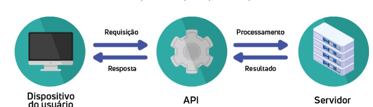

# O que é API 

- interface de programação de aplicações ( Aplication Programming Interface) 
- Conjunto de regras que permite a comunicação entre diferentes softwares. 
- "ponte" entre duas aplicações. 

## API REST 

- **Representational State Transfer** — transferência de representação de estado
- Estilo arquitetural para construir APIs usando os princípios do protocolo HTTP
- **Métodos HTTP (Verbs):** GET, POST, PUT, DELETE, PATCH
  - `GET` — recupera/lê dados de um recurso
  - `POST` — cria um novo recurso
  - `PUT` — substitui/atualiza um recurso completo
  - `DELETE` — remove um recurso
  - `PATCH` — atualiza parcialmente um recurso
- **Recursos identificados por URLs** — cada URL representa um recurso (ex: `/usuarios/1`, `/produtos/42`)
- **Sem estado (Stateless)** — cada requisição contém todas as informações necessárias
- **Retorna representações em JSON ou XML** — o cliente recebe os dados em um formato estruturado (JSON é o mais comum)
- **Status HTTP significativos** — respostas indicam sucesso (200, 201), erro do cliente (400, 404) ou servidor (500) 